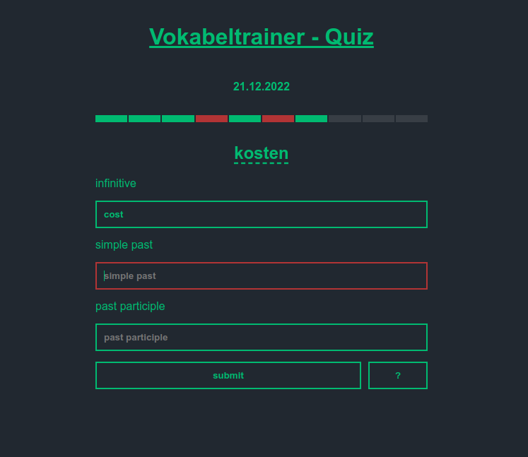

# vokabeltrainer

To help my sister learn the irregular verbs for her english lessons, i decided to program this little quiz. 

It's build on a python flask server which reads the vocabulary from a csv-file and serves a webpage with the quiz or the results. The quiz asks ten german verbs and you have to give the three correct english forms as the answer. As a motivational gimmick you get a little animal image if you passed the quiz with at least five correct answers. When you passed the quiz or it was already played that day, the webpage shows your results.

---

### How it's used:

To use the *vokabeltrainer* i hosted it on a raspberry pi in my home network. The daily quiz can then be accessed from any device in the network.

 --- 

__I know this isn't failproof or perfectly worked out, but feel free to test and use it.__

__Credits:__ The animal images which i used as awards where made by *Freepik*, *Flat Icon*, *Good Ware*, and *surang* from *flaticon.com*. 
